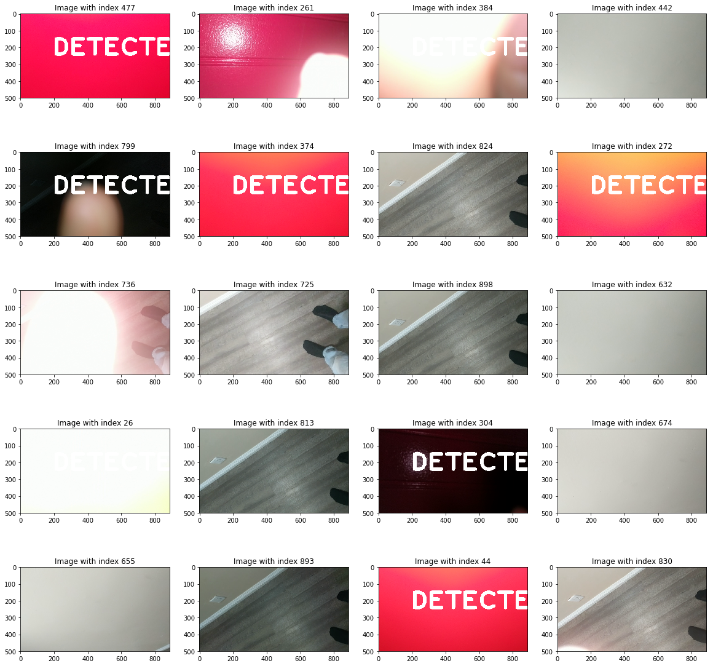
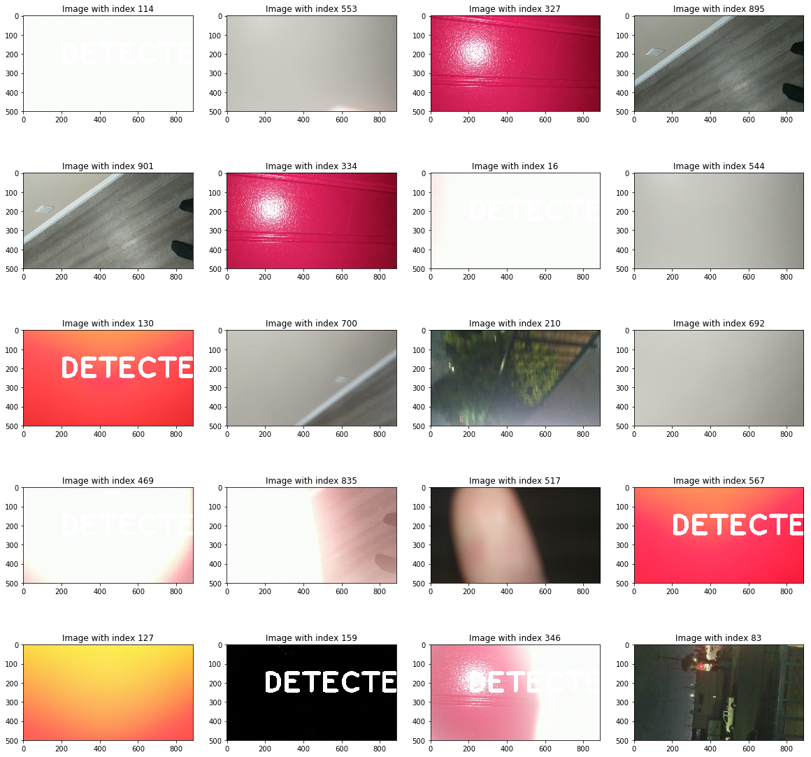
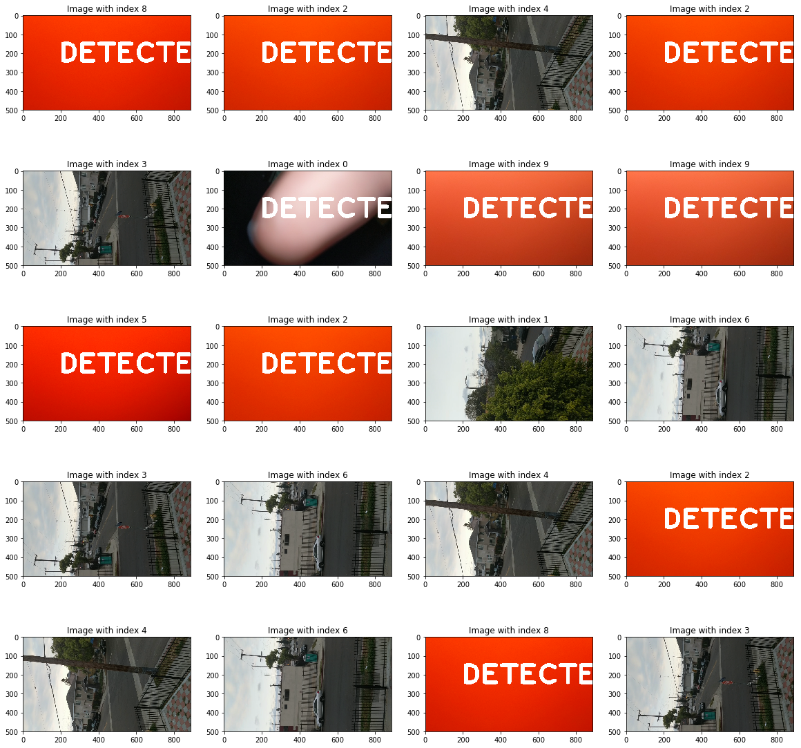

# EXPLORATORY DATA ANALYSIS ON COMPUTATIONALLY EFFICIENT CAMERA BLOCKING DETECTION APPROACHES

Exploring computationally efficient methods to detect whether the camera is blocked by a finger. Such detection mechanisms can be useful in use with mobile devices. Different approaches are explored:

### [Notebook](EDA-Camera-Blocking-CV.ipynb)

## Results

### Signal Processing 
Signal Processing approach uses a threshold to determine from the brightness when the camera is blocked

### Machine Learning
Machine Learning approach uses the histogram of the RGB image to train on blocked images vs clear images to determine if the camera is blocked

### Deep Learning

Deep Learning approach uses deep conv network to determine whether the camera is blocked.

This project is purely for fun, no real value is present in this work but is an interesting problem to compare different approaches and their performance at solving exactly the same problem. 
